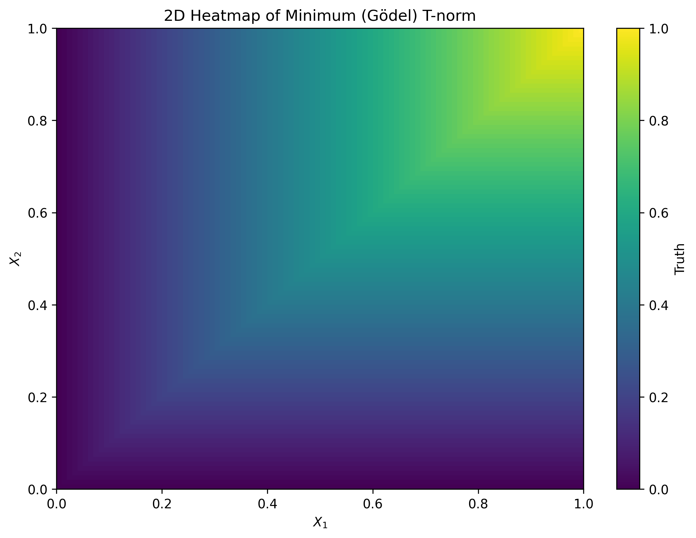
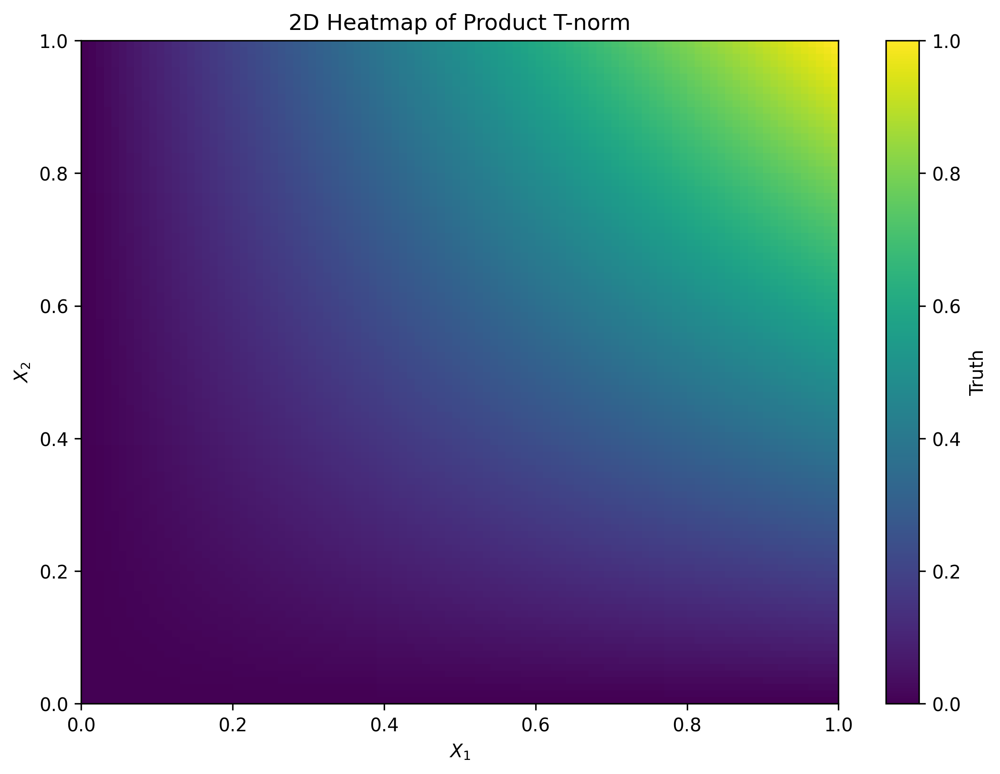
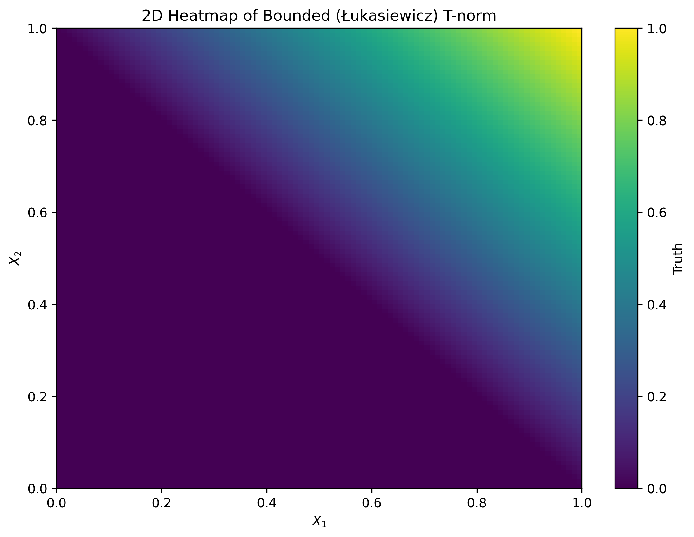
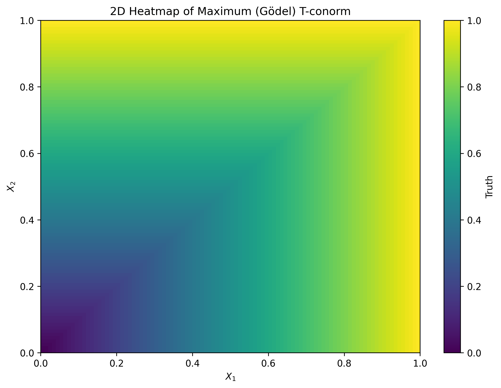
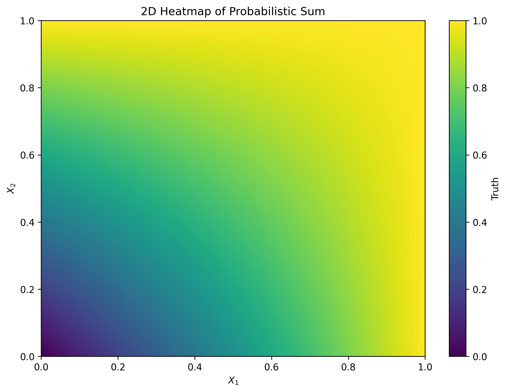
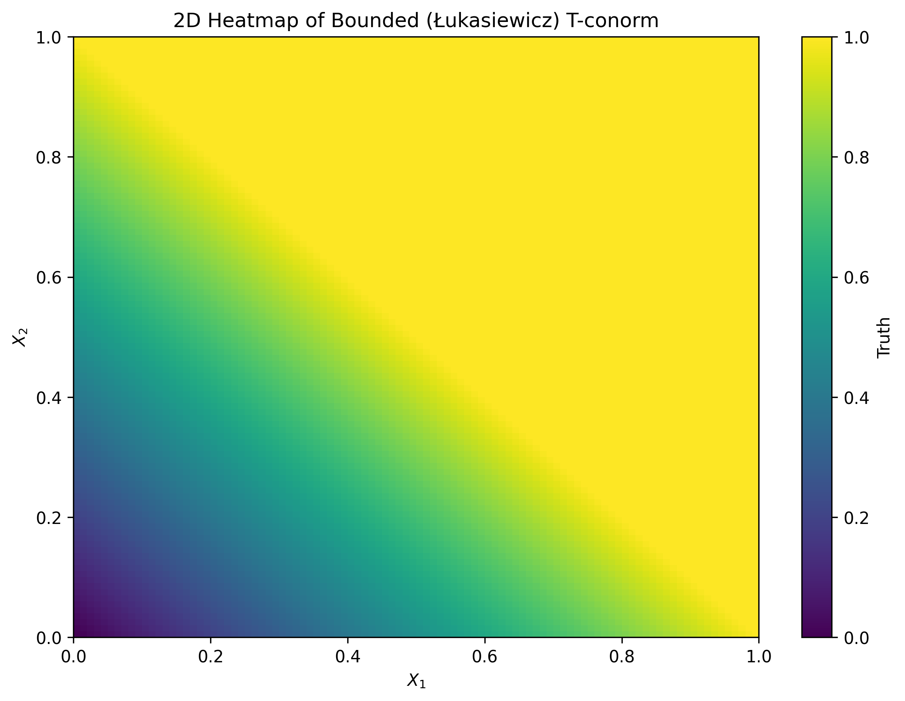
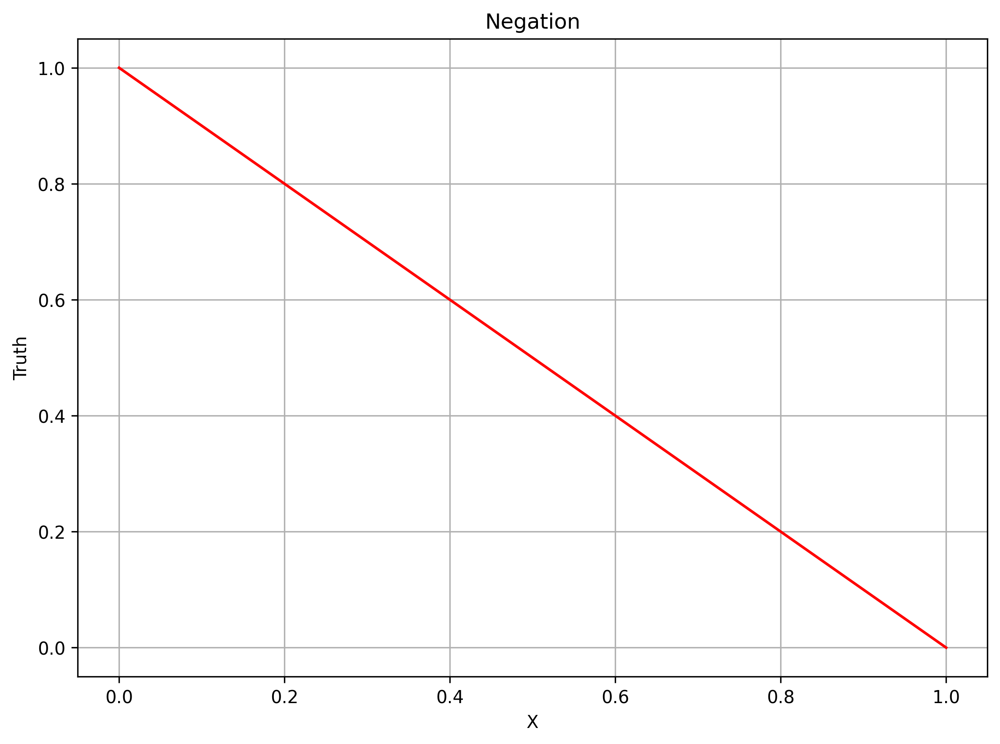

## Introduction to Logic

I always though researching logic to help me implement AI methods that are more focused on reasoning, planning, explainability, etc. However, the logic is discrete by nature which has two strict values: $\\{ \text{True}, \text{False} \\}$ This limits the expressibility and makes it difficult to implement in a differential manner. One alternative is to use approximations of logical values which can have any real value between $\[ 0.0, 1.0 \]$. This makes logic more flexiable and expressive. For any approximated Boolean variable $x$, logic expression $x \in \[ 0.0, 1.0 \]$, can be expressed as floating-point values instead of discerete two states.

Assuming the Boolean variable $x$ values are uniformly distributed in $\[ 0.0, 1.0 \]$, we can make the binarization decision given below:

$$
\mathcal{T}_{binary} = 
    \begin{cases} 
        \text{True }  & \text{if } x \geq 0.5  \\\\ 
        \text{False } & \text{if } x < 0.5 
    \end{cases}
$$

Where, $\mathcal{T}_{binary}$ is final dicrete truth value in traditional sense. So, any value close to $0.0$ is considered *more False* and any value to close $1.0$ is considered *more True*. This is similar to any binary classification model with sigmoid output and decision boundary is set to $0.5$. However, it would be beneficial to keep everything strictly numerical. Alternatively, we can assign True to 1 and False to 0 for strict numerical results, given below: 

$$
\mathcal{T}_{binary} = 
    \begin{cases} 
        \text{1 }  & \text{if } x \geq 0.5  \\\\ 
        \text{0 } & \text{if } x < 0.5 
    \end{cases}
$$

## Implementing Logic Approximations

I will use JAX (which is my favorite) for implementations. First, let's initilize two JAX arrays with approximated logic values:

~~~python
import jax
import jax.numpy as jnp

x1 = jnp.array((0.50, 0.50, 0.75, 0.25))
x2 = jnp.array((0.55, 0.25, 0.15, 0.45))
~~~

We can implement binarize function to convert approximated Boolean values into dicrete logic:

~~~python
def binarize(x):
    return jnp.where(x>=0.5, 1, 0)
~~~

Also print the mappings:

~~~python
def print_binary(x):
    for x_real, x_binary in zip(x.tolist(), binarize(x).tolist()):
        x_binary_str = 'True' if x_binary == 1 else 'False'
        print(f'{x_real:2.2f} --> {x_binary:1d} ({x_binary_str})')

print('x1:')
print_binary(x1)
print('x2:')
print_binary(x2)
~~~

As we can see below, values that $\geq 0.5$ are mapped to 1 and values $< 0.5$ are mapped to 0.

~~~text {linenos=false}
x1:
0.50 --> 1 (True)
0.50 --> 1 (True)
0.75 --> 1 (True)
0.25 --> 0 (False)
x2:
0.55 --> 1 (True)
0.25 --> 0 (False)
0.15 --> 0 (False)
0.45 --> 0 (False)
~~~

### T-Norm and T-Conorms

We have Boolean variables approximated to represent True or False, it is time to build logical connectives to perform operations on variables. Triangular norms (T-norms, T-conorms) are useful for building such operations. 

T-Norms and T-conorms are classes of functions that operate in interval $T: \[ 0.0, 1.0 \] \times \[ 0.0, 1.0 \] \rightarrow \[ 0.0, 1.0 \]$. They go back as far as Probabilistic Metric Spaces (Menger, K., 1942) which lays the foundation. Their properties investigated later as triangle functions (Schweizer, B., and Sklar, A., 1960). Fuzzy logic is commonly used in approximations of logic operators for real values (Hájek, P., 1998). 

For building logical connectives, basically we have:

- Conjuction (logical AND) is defined as *T-norm*
- Disjunction (logical OR) is defined as *T-conorm* (also called *S-norm*)

### T-Norm implementations

Three types of t-norms strike me the most: minimum (also called the Gödel), product and bounded (also called the Łukasiewicz) t-norm. 

- Minimum (Gödel) t-norm: $T_{min} (x_1, x_2) = \text{min} \\{x_1, x_2\\}$
- Product t-norm: $T_{prod} (x_1, x_2) = x_1 \cdot x_2$
- Bounded (Łukasiewicz) t-norm: $T_{boun} (x_1, x_2) = \text{max} \\{0, x_1 + x_2 - 1 \\} $

Their implementation in JAX is given below:

~~~python
def t_norm_min(x1, x2):
    """
    Minimum (Gödel) T-norm
    """
    return jnp.minimum(x1, x2)

def t_norm_product(x1, x2):
    """
    Product T-norm
    """
    return x1*x2

def t_norm_bounded(x1, x2):
    """
    Bounded (Łukasiewicz) T-norm
    """
    return jnp.maximum(0.0, x1+x2-1.0)
~~~

### Plotting T-Norm Truths

  

    
  

  

    
  

  

    
  

Investigating the plots above, we can see that logical conjuction (AND) operation between $x_1$ and $x_2$ is approximated in real space. Truth values peak around $x_1 = 1.0$, $x_2 = 1.0$ for all three but each with own characterisics. Minimum and product t-norms are similar but product t-norm outputs smoother increase then minimum t-norm. The Łukasiewicz t-norm forms a strict upper surface boundary, hence it is *"bounded"*. This bounded characteristic makes a difference in generation of norm functions (which we will study later).

### T-conorm implementations

T-conorms are used for disjunction connectives instead of conjuction (like t-norms). Similarly for the t-conorms, maximum (Gödel) t-conorm, probabilistic sum and bounded (Łukasiewicz) sum t-conorm. 

(They are also called S-norms and I will use notation $S$ to avoid confusion with t-norms.)

- Maximum t-conorm: $S_{max} (x_1, x_2) = \text{max}\\{ x_1, x_2 \\}$
- Probabilistic sum: $S_{sum} (x_1, x_2) = x_1 + x_2 - x_1 \cdot x_2 = 1 - (1-x_1) \cdot (1 - x_2)$
- Bounded (Łukasiewicz) t-conorm: $S_{boun} (x_1, x_2) = \text{min} \\{ x_1 + x_2, 1 \\}$ 

And their implementation in JAX:

~~~python
def t_conorm_maximum(x1, x2):
    """
    Maximum (Gödel) T-conorm
    """
    return jnp.maximum(x1, x2)

def t_conorm_sum(x1, x2):
    """
    Probabilistic Sum
    """
    return x1+x2-x1*x2

def t_conorm_bounded(x1, x2):
    """
    Bounded (Łukasiewicz) T-conorm
    """
    return jnp.minimum(x1+x2, 1.0)
~~~

(Of course, t-norms and t-conorms are not limited to these above, but I decided to implement them.)

### Plotting T-Conorm Truths

  

    
  

  

    
  

  

    
  

We can see that logical disjunction (OR) operation between $x_1$ and $x_2$ is approximated in real space. Truth values are lowest around $x_1 = 0.0$, $x_2 = 0.0$ and higher elsewhere. Similarly to t-norms, maximum and probabilistic sum shows similar yet second show smoother while the Łukasiewicz t-conorm show a *"bounded"* characteristic. 

### Negation

We convered conjuction and disjuction implementations. However, we also need negation (logical NOT) to fully realize logical expressions. We do not need triangular norms for negation, it is straightforward as given below:

~~~python
def negation(x):
    return 1.0-x
~~~

  

    
  

## Differential Optimization of Truth

### Initialization

Now that we have the basics, let's get into the differential part. Let's assume we want to find $x_1$ and $x_2$ values that yields True for the logical statement below, where $\mathcal{T}_{final}$ denotes overall final truth value:

$$
\mathcal{T}_{final} = X_1 \land \neg X_2 \tag{1}
$$

First we need to initialize boolean variables $x_1, x_2 \in \[0.0, 1.0 \]$. To keep values in valid range, I decided to initialize values around 0.5 with some variations:

$$
x_{1,2} = 0.5 + \mathcal{N}(0.0, \sigma^2)
$$

I use "*noise_scale*" constant to adjust the noise variance. To keep values around 0.5, standart deviation of $\sigma = 0.1$ should be enough.

~~~python
import jax.random as jrd

SEED = 1234

def init_logical_array(array_shape, key, noise_scale=0.1):
    noise = jrd.normal(jrd.key(key), array_shape) * noise_scale
    # any shaped array centered around 0.5
    return 0.5 * jnp.ones(array_shape) + noise

x1, x2 = init_logical_array((2,), SEED)
print(f'Initial value of X_1: {float(x1):.3f} and X_2: {float(x2):.3f}')
~~~

~~~text {linenos=false}
Initial value of X_1: 0.610 and X_2: 0.586
~~~

### Select T-norm and T-conorm Functions

We have multiple t-norm and t-conorm options, the code below helps us try different realizations:

(Product and probabilistic sum norm functions provide smoother transitions, so I prefer them for now.) 

~~~python
VALID_TNORM_FUNCTIONS = {
    'minimum': t_norm_min,
    'product': t_norm_product,
    'bounded': t_norm_bounded,
}

VALID_TCONORM_FUNCTIONS = {
    'maximum': t_conorm_maximum,
    'probabilistic_sum': t_conorm_sum,
    'bounded': t_conorm_bounded
}

def diff_and(x1, x2, name='product'):
    _name = name.lower().strip()
    if _name not in VALID_TNORM_FUNCTIONS.keys():
        raise ValueError(f'{name} is a valid AND realization, select from: {VALID_TNORM_FUNCTIONS.keys()}')
    selected_realization = VALID_TNORM_FUNCTIONS[_name]
    return selected_realization(x1, x2)

def diff_or(x1, x2, name='probabilistic_sum'):
    _name = name.lower().strip()
    if _name not in VALID_TCONORM_FUNCTIONS.keys():
        raise ValueError(f'{name} is a valid AND realization, select from: {VALID_TCONORM_FUNCTIONS.keys()}')
    selected_realization = VALID_TCONORM_FUNCTIONS[_name]
    return selected_realization(x1, x2)

def diff_not(x):
    # (SINGLE REALIZATION OF NOT, BUT CAN BE ADDED LATER)
    # (THIS IS FOR FUTURE COMPATIBILITY)
    return negation(x)
~~~

### Updates with Gradients

Since we wish to maximize the truth $\mathcal{T}_{final}$, I prefer gradient ascent instead of descent to update randomly initialized $x_1$ and $x_1$. Gradient vector in this case will point to the maximum truth value. 

The equations 2 and 3 below, will update the $x_1$ and $x_2$ towards the point where $\mathcal{T}_{final}$ is maximum, with learning rate $\alpha$. 

$$
x_1 = x_1 + \alpha \cdot \frac{\partial \mathcal{T}_{final}}{\partial x_1} \tag{2}
$$

$$
x_2 = x_2 + \alpha \cdot \frac{\partial \mathcal{T}_{final}}{\partial x_2} \tag{3}
$$

We don't need to compute derivaties manually, JAX provides automatic differentiation that builds the compute graph to calculate partial derivaties of $\mathcal{T}_{final}$ w.r.t  $x_1$ and $x_2$.

~~~python
def truth_fn(x1, x2):
    return diff_and(x1, diff_not(x2))

grad_fn = jax.value_and_grad(truth_fn, argnums=(0, 1))
~~~

### Main Optimization Loop

The loop below, computes gradients, updates variables and keeps the variables in range with clipping. (If you are familiar with machine/deep learning, this loop is essetially the forward and backward propagation)

~~~python
NUM_EPOCHS = 10
LEARNING_RATE = 1e-1

for epoch in range(1, NUM_EPOCHS+1):
    # CALCULATE GRADIENTS
    truth_val, (dT_dx1, dT_dx2) = grad_fn(x1, x2)

    # UPDATE VALUES USING GRADIENT ASCENT
    x1 = x1 + LEARNING_RATE*dT_dx1
    x2 = x2 + LEARNING_RATE*dT_dx2
    
    # (ENSURE LOGICAL APPROXIMATIONS IN VALID RANGE)
    x1 = jnp.clip(x1, 0.0, 1.0)
    x2 = jnp.clip(x2, 0.0, 1.0)

    print(f"{'Epoch':<6} | {'Truth':<8} | {'X_1':<8} | {'X_2':<8}")
    print(f'{epoch:<6} | {truth_val:<8.4f} | {x1:<8.4f} | {x2:<8.4f}')
    print()
~~~

~~~text {linenos=false}
Epoch  | Truth    | X_1      | X_2     
1      | 0.2525   | 0.6517   | 0.5253  

Epoch  | Truth    | X_1      | X_2     
2      | 0.3094   | 0.6992   | 0.4601  

Epoch  | Truth    | X_1      | X_2     
3      | 0.3775   | 0.7531   | 0.3902  

Epoch  | Truth    | X_1      | X_2     
4      | 0.4593   | 0.8141   | 0.3149  

Epoch  | Truth    | X_1      | X_2     
5      | 0.5578   | 0.8826   | 0.2335  

Epoch  | Truth    | X_1      | X_2     
6      | 0.6766   | 0.9593   | 0.1452  

Epoch  | Truth    | X_1      | X_2     
7      | 0.8200   | 1.0000   | 0.0493  

Epoch  | Truth    | X_1      | X_2     
8      | 0.9507   | 1.0000   | 0.0000  

Epoch  | Truth    | X_1      | X_2     
9      | 1.0000   | 1.0000   | 0.0000  

Epoch  | Truth    | X_1      | X_2     
10     | 1.0000   | 1.0000   | 0.0000  
~~~

As we can see from the results above, randomly intializing boolean variables $x_1$ and $x_2$ yield low truth values at first, but as we update roughly 10 iterations (epochs), we find that $x_1=1.0$ and $x_2=0.0$ gives us the maximum truth for statement in equation 1. 

### Binary Evaluation

We can also verify this with binary evaluation as well:

~~~python
def evaluate_binary(x1, x2):

    x1_binary = binarize(x1)
    x2_binary = binarize(x2)

    truth_binary = (x1_binary and (not x2_binary))

    print(f'Binary logic value of x_1: {bool(x1_binary)}')
    print(f'Binary logic value of x_2: {bool(x2_binary)}')
    print(f'Binary logic value of T_final: {truth_binary}')

evaluate_binary(x1, x2)
~~~

Again we see that for $x_1 = \text{True}$, $x_2 = \text{False}$ we get desired $\mathcal{T}_{final} = \text{True}$ result for the statement given in the equation 1.

~~~text {linenos=false}
Binary logic value of x_1: True
Binary logic value of x_2: False
Binary logic value of T_final: True
~~~

We convered the simple case in this post. You can manually derive the result without any differential optimization. However, this is the foundation that we need for more insteresting examples in the future. 

## References

- Klement, E. P., Mesiar, R., & Pap, E. (2000). Triangular norms. Kluwer Academic Publishers. https://doi.org/10.1007/978-94-015-9540-7

- Klement, E. P., Mesiar, R., & Pap, E. (2004). Triangular norms. position paper I: Basic analytical and algebraic properties. Fuzzy Sets and Systems, 143(1), 5–26. https://doi.org/10.1016/j.fss.2003.06.007 

- Menger, K. (1942). Statistical metrics. Proceedings of the National Academy of Sciences of the United States of America, 28(12), 535–537. https://doi.org/10.1073/pnas.28.12.535

- Hájek, P. (1998). Metamathematics of fuzzy logic. Kluwer Academic Publishers.

- Sun, J. (2025). Characterization of t-norms on normal convex functions. arXiv. https://doi.org/10.48550/arxiv.2511.17640

- Schweizer, B. and Sklar, A. (1960) Statistical Metric Spaces. Pacific Journal of Math., 10, 313-334. http://dx.doi.org/10.2140/pjm.1960.10.313

